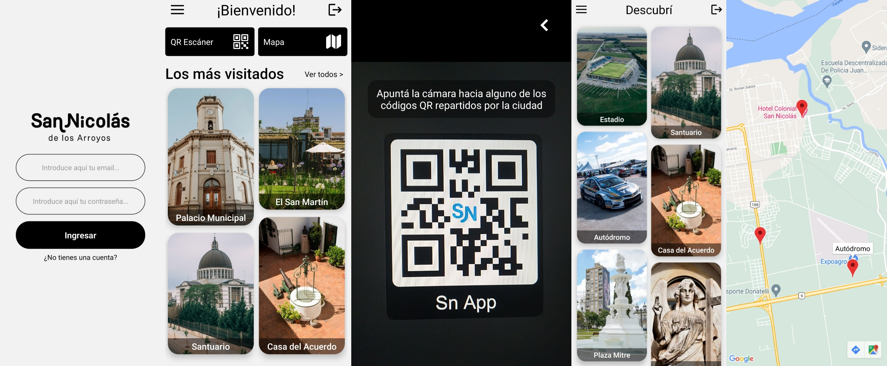

# SN Companion App

<src img="./src/assets/repository-header.jpg">

Esta aplicación tiene como objetivo ser un apoyo turísitico para los visitantes de la ciudad de San Nicolás de los Arroyos. La App permitirá conocer la historia de distintos puntos de interés de la ciudad.  

## Contexto del desarrollo  
Esta aplicación fue desarrollada como proyecto de final del curso _"Desarrollo de Aplicaciones"_, dictado por Coderhouse. La consigna consiste en desarrollar una aplicación de temática a elección, en la cual se integren los conceptos vistos en clase.  

## Ejecución del proyecto
Clonación del repositorio:
```sh
git clone https://github.com/fedesummo/coder_mobile_app
```

Instalación de dependencias:
```sh
cd coder_mobile_app
npm i
```

Iniciación del servidor:
```sh
npm start
```

Luego, la aplicación puede ejecutarse desde el cliente de _Expo_ o desde una máquina virtual en _Android Studio_.

## Dependencias utilizadas
- Firebase Auth: servicio de autenticación en la nube.
- Firebase Realtime Database: base de datos NoSQL en la nube, utilizada para almacenar los datos de la aplicación.
- SQLite: base de datos SQL utilizada para almacenar información de forma local en el dispositivo.
- Axios: cliente HTTP utilizado para realizar consultas a la API.
- React navigation: librería utilizada para gestionar la navegación de la aplicación.
- Masonry list: librería utilizada para crear listas con formato masonry.
- Barcode scanner: librería utilizada para escanear códigos QR y gestionar los permisos de la cámara.

## Información sobre las pantallas


### Inicio de sesión
Autenticación del usuario.

### Registro
Alta de usuario en la base de datos.

### Inicio
Acceso a las distintas pantallas de la aplicación.

### Descubrí
Lista de distintos puntos de la ciudad.

### Lugar
Vista en detalle de un punto.

### Mapa
Visualización de los puntos en Google Maps.

### QR Escáner
Apartado de cámara para escanear códigos QR. Los códigos contienen una referencia a un lugar de la ciudad.    


## Acerca del desarrollador
Mi nombre es Federico Summo, tengo 22 años, y soy estudiante de _Desarrollo Web_ y _Desarrollo de Aplicaciones Móviles_.
Actualmente trabajo como desarrollador para el municipio de San Nicolás de los Arroyos, realizando aplicaciones web útiles para los habitantes de la ciudad.
Me encantaría hacer conexión con los interesados en este proyecto, por lo que dejo a continuación mi perfil de
[LinkedIn](https://www.linkedin.com/in/federico-summo/).