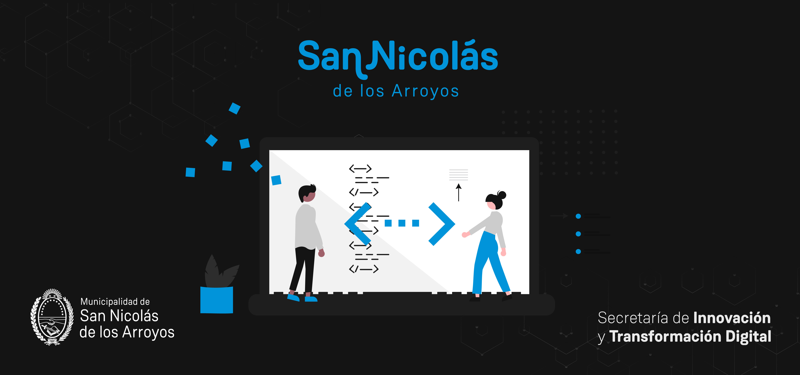

# SN App - React Native 🚀​



## Tabla de contenidos

- [Descripción del proyecto](#descripción-del-proyecto)
- [Contexto del desarrollo](#contexto-del-desarrollo)
- [Capturas de pantalla](#capturas-de-pantalla)
- [Instalación y ejecución de la aplicación](#instalación-y-ejecución-de-la-aplicación)
- [Servicios y dependencias utilizadas](#servicios-y-dependencias-utilizadas)
- [Escáner de códigos QR](#escáner-de-códigos-qr)
- [Acerca del desarrollador](#acerca-del-desarrollador)

## Descripción del proyecto

La presente aplicación tiene como objetivo ser un apoyo turísitico para los visitantes de la ciudad de _San Nicolás de los Arroyos_, permitiendo conocer la historia de distintos puntos de interés de la localidad.

## Contexto del desarrollo

Esta aplicación fue desarrollada como proyecto de final del curso _"Desarrollo de Aplicaciones"_, dictado por Coderhouse. La consigna consistía en desarrollar una aplicación de temática a elección, en la cual se integraran los conceptos tratados a lo largo del curso.

## Capturas de pantalla


## Instalación y ejecución de la aplicación

1. Clonar el repositorio:

```
git clone https://github.com/fedesummo/coder_mobile_app
```

2. Ingresar al directorio del proyecto

```
cd coder_mobile_app
```

3. Instalar dependencias:

```sh
npm i
```

4. Iniciar el servidor:

```sh
npm start
```

Luego, la aplicación puede ejecutarse a través del cliente de _Expo_ desde un dispositivo físico o emulador iOS o Android.

## Servicios y dependencias utilizadas

| Nombre                                                                             | Detalle                                 |
| ---------------------------------------------------------------------------------- | --------------------------------------- |
| [Firebase Auth](https://firebase.google.com/docs/reference/rest/auth)              | Servicio de autenticación en la nube    |
| [Firebase Realtime Database](https://firebase.google.com/docs/database/rest/start) | Base de datos NoSQL en la nube          |
| [SecureStore](https://docs.expo.dev/versions/latest/sdk/securestore)               | Base de datos NoSQL local               |
| [SplashScreen](https://docs.expo.dev/versions/latest/sdk/splash-screen)            | Pantalla de carga inicial               |
| [Axios](https://axios-http.com)                                                    | Cliente HTTP                            |
| [React navigation](https://reactnavigation.org/docs/getting-started)               | Gestor de navegación                    |
| [React Redux](https://react-redux.js.org)                                          | Gestor de estado global                 |
| [MapView](https://docs.expo.dev/versions/latest/sdk/map-view)                      | Gestor de mapas                         |
| [Masonry list](https://www.npmjs.com/package/@react-native-seoul/masonry-list)     | Creación de listas con formato masonry |
| [BarCodeScanner](https://docs.expo.dev/versions/latest/sdk/bar-code-scanner)       | Escáner de códigos QR                   |

## Escáner de códigos QR

Desde el apartado correspondiente de la aplicación pueden escánearse códigos QR como el que se muestra debajo. Los códigos permiten acceder a la vista en detalle de los diferentes puntos de interés de la ciudad.


## Acerca del desarrollador

Mi nombre es Federico Summo y soy estudiante de _Desarrollo Web_ y _Desarrollo de Aplicaciones Móviles_.  
Actualmente trabajo como desarrollador en la _Secretaría de Innovación y Transformación Digital_ realizando aplicaciones útiles para los habitantes y visitantes de la ciudad.  
Si estás interesado/a en este proyecto, puedes contactarme a través de mi perfil de
[LinkedIn](https://www.linkedin.com/in/federico-summo/).
